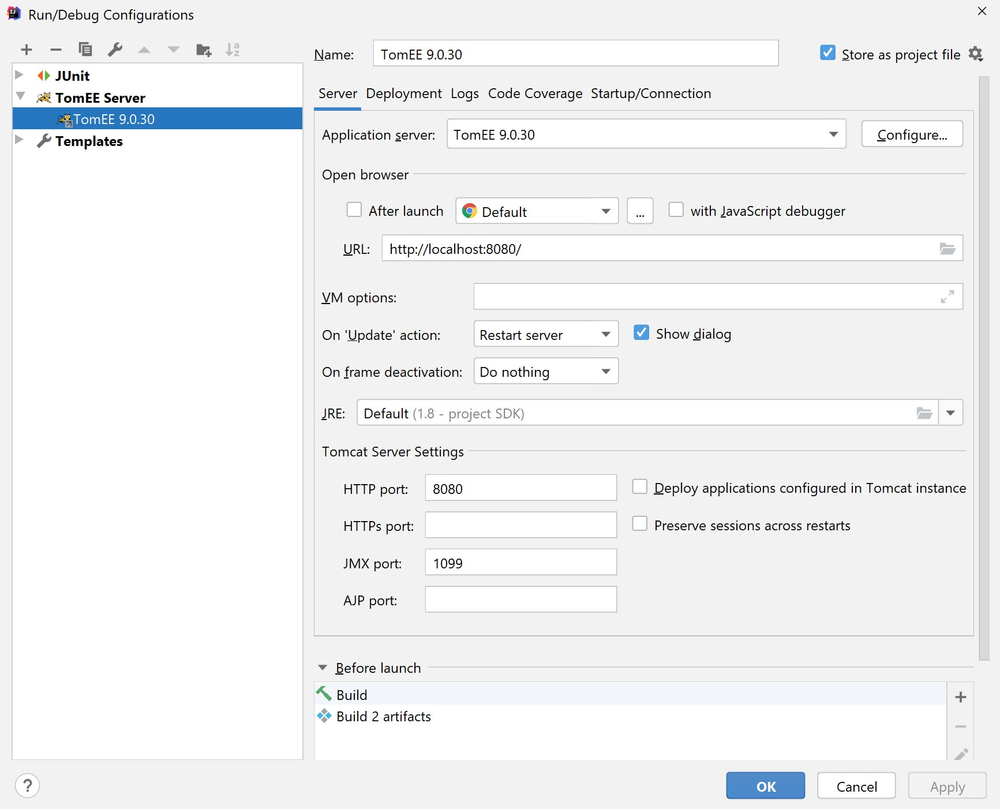
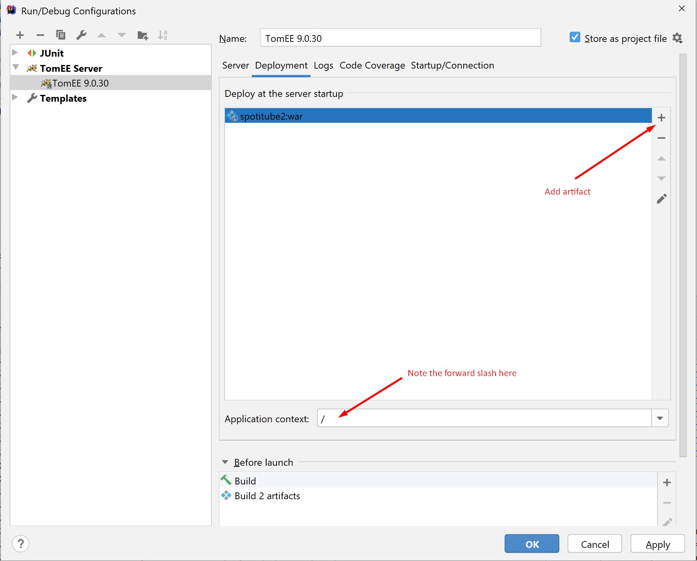

# Spotitube-REST-API

This repository contains a back-end for the final programming assignment 
of the course OOSE-DEA at the [HAN University of Applied Sciences](https://www.han.nl/).

Front-end of the app provided by HAN: https://github.com/HANICA-DEA/spotitube. All features and requirements can be found in the readme of this repository.

# Features

This layered application is built using Java 8, TomEE, MySQL, JUnit and Mockito

1. Authentication
2. CRUD-operations for playlists
3. CRUD-operations for tracks in playlists
4. [JSON Web Tokens](https://jwt.io)
4. Automated unit tests using JUnit and Mockito

# How to run back-end
1. Clone and import this repository as a Maven project in an IDE of choice (pictures use IntelliJ IDEA).
2. Add a run configuration

3. Add the artifact (war) to deploy

4. Configure TomEE  
  4.1. Locate your TomEE installation directory  
  4.2  Open `/conf/context.xml`  
  4.2. Add the following to `context.xml` and replace the username and password with your MySQL credentials.
       _***Note:*** This is a global TomEE setting that will be used for all your projects_    
```xml 
<?xml version="1.0" encoding="UTF-8"?>
<Context>

    <!-- Default set of monitored resources. If one of these changes, the    -->
    <!-- web application will be reloaded.                                   -->
    <WatchedResource>WEB-INF/web.xml</WatchedResource>
    <WatchedResource>WEB-INF/tomcat-web.xml</WatchedResource>
    <WatchedResource>${catalina.base}/conf/web.xml</WatchedResource>

    <!-- Uncomment this to disable session persistence across Tomcat restarts -->
    <!--
    <Manager pathname="" />
    -->
    <Resource
            name="jdbc/Spotitube"
            auth="Container"
            type="javax.sql.DataSource"
            maxTotal="100"
            maxIdle="30"
            driverClassName="com.mysql.cj.jdbc.Driver"
            url="jdbc:mysql://localhost:3306/spotitube"
            username="YOUR_USERNAME_HERE"
            password="YOUR_PASSWORD_HERE"
            jtamanaged="true"
    />
</Context>
```
5. Run `DDL_INSERT.sql` in your MySQL instance
6. Run the project (Ctrl + F5 in IntelliJ IDEA)

# How to run front-end
1. Clone the front-end of the app https://github.com/HANICA-DEA/spotitube (provided by HAN)
2. Follow the [installation instructions](https://github.com/HANICA-DEA/spotitube#for-local-installation) 